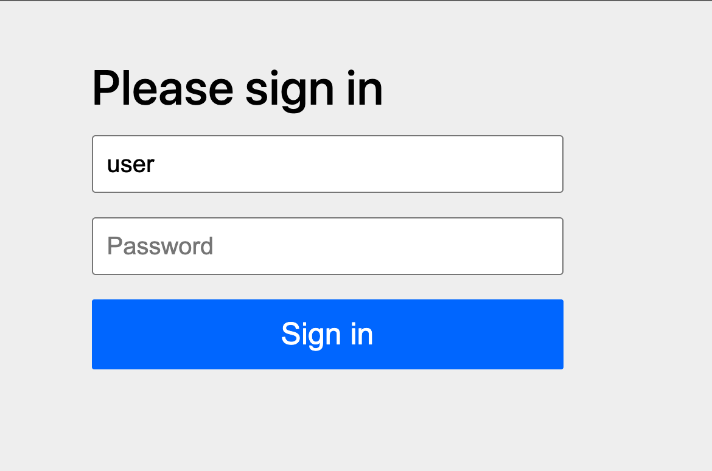
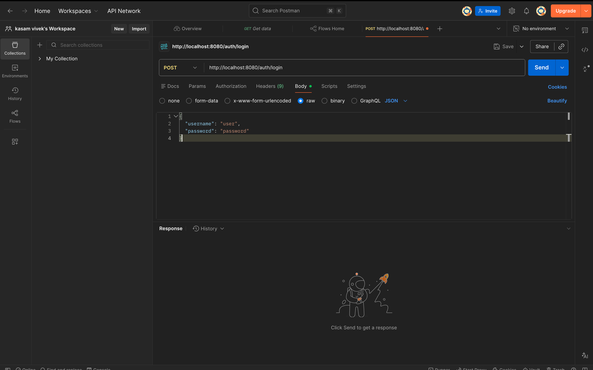
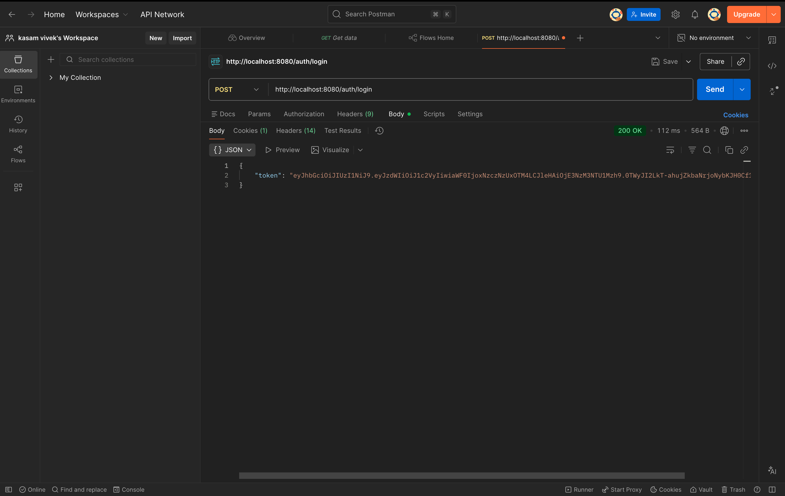
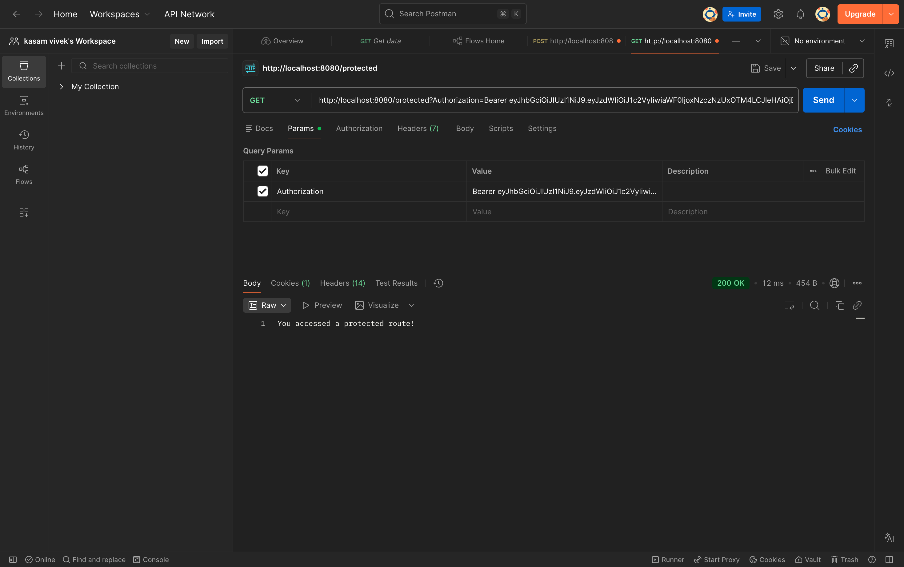

# 🔐 JWT Authentication System (Spring Boot)

## 🚀 Overview

A secure backend application built using **Spring Boot** that implements **JWT (JSON Web Token) authentication**.

This project demonstrates how to:

* Authenticate users
* Generate JWT tokens
* Protect API endpoints

---

## 🛠️ Tech Stack

* Java 17
* Spring Boot
* Spring Security
* JWT (io.jsonwebtoken)
* Maven
* Postman

---

## 🔑 Features

* User login authentication
* JWT token generation
* Secure protected APIs
* Stateless authentication
* H2 database integration

---

## 📂 API Endpoints

### 🔹 Login API

* **POST** `/auth/login`

Request:

```json
{
  "username": "user",
  "password": "password"
}
```

Response:

```json
{
  "token": "JWT_TOKEN"
}
```

---

### 🔹 Protected API

* **GET** `/protected`

Header:

```
Authorization: Bearer YOUR_TOKEN
```

Response:

```
You accessed a protected route!
```

---

## 📸 Screenshots

### 🔐 Login Page



### 🏠 Backend Working


### 📤 Login Request (Postman)



### 🔑 Token Response



### 🔒 Protected Route



---

## ⚙️ How to Run

```bash
git clone https://github.com/kasamvivek/exp6.git
cd exp6
mvn spring-boot:run
```

Open:

```
http://localhost:8080
```

---

## 🎯 What I Learned

* JWT authentication flow
* Spring Security configuration
* API protection techniques
* Real-world backend structure

---

## 👨‍💻 Author

Kasam Vivek Reddy
23BAI70214
